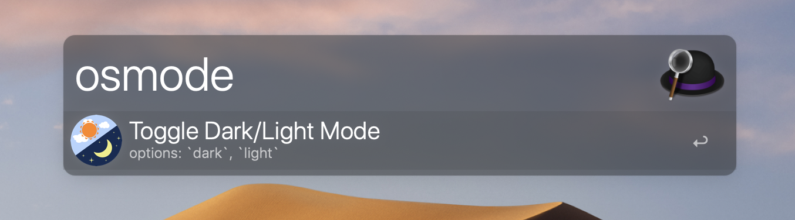
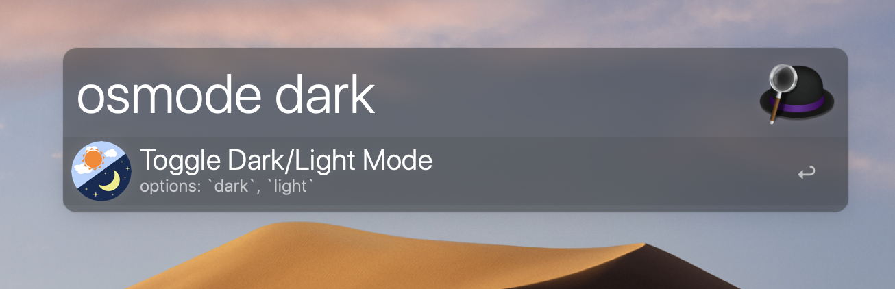
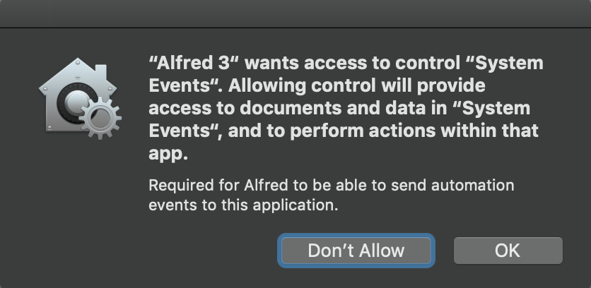

DarkOrLight
---
Change macOS theme to Dark/Light with one click.
[Download](https://github.com/BaksiLi/AlfredWorkflows/tree/master/workflows/DarkOrLight.alfredworkflow?raw=true)

[Dark Mode](https://support.apple.com/en-us/HT208976) is a new feature on macOS Mojave, which darkens the system appearance to help focusing.

**macOS Mojave or above required.**

# Installation
Double-click on *DarkOrNigh.alfredworkflow* (or *info.plist* in the folder), then Alfred will start loading it.  

# Usage
1. `osmode` to toggle Dark/Light Mode

1. `osmode <option>` to change to a specific mode, options are *dark* and *light*.

# Troubleshooting
For the first time DarkOrLight is toggled, you will be asked for the permission. This is necessary for the workflow to function.

# Acknowledgement
This workflow is also published on [Packal](http://www.packal.org/workflow/darkorlight).
