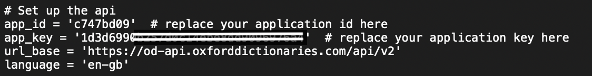

# say-workflow

Read out something swiftly. [Download](https://github.com/BaksiLi/AlfredWorkflows/blob/master/workflows/say_command.alfredworkflow?raw=true)

<sub>Update: The version after 0.6 includes a new keyword `pronounce`. If you prefer not having it, you could either download [the old version](https://github.com/BaksiLi/AlfredWorkflows/blob/master/workflows/say_command_0.5.alfredworkflow?raw=true) or delete disable the keyword in the workflow manually.</sub>

Does this ever happen to you?
That you want to have a *quick check of the pronunciation* of a word/sentence without being diverted too much,
Or you want to *surprise your classmates in a boring lecture* (and no one would realise that's you)?

Now with say-workflow, you can do all of these just with simple clicks on your keyboard.

This workflow is designed for [*Alfred3*](http://alfredapp.com) or above. For full functionality, you should have the following:

Keyword \ Requirements | Alfred Powerpack | *requests*\* | *afplay* | OED API
----- | ----- | ----- | ----- | -----
`say` | Yes | No | No | No
`pronounce` | Yes | Yes | Yes | Yes

<sub>* for for python (/usr/bin/python).</sub>

## Installation
Double-click on *say_command.alfredworkflow* or *info.plist* in the folder, Alfred will start loading it.

For `pronounce`, you should register at [Oxford English Dictionary API](https://developer.oxforddictionaries.com/) to get a developer API id and key. Fill them into the workflow manually to enable this keyword.

## Usage
It reads text swiftly without open terminal or a text file. 
### Say
1. Toggle Alfred
  

1. Type in the keyword
    
  ```say``` and return, or
    
1. Type in either **Language code** or the text directly
  by default, it will speak in the language of your system's preference:  
    
  this is the same from saying  
  `say: Can't understand at all!` in the Terminal.  
  or you could indicate what language do you want it to speak in:  
    
  with or without blank space after it:  
    
  and return, bob's your uncle!

Since ver. 0.4, say-workflow is able to recognise anagrams of the language codes. E.g. `Pj` and `Jp` are valid synonyms for `jp`. 

### Pronounce (after ver. 0.6)
  ``` pronounce``` followed by a word that you want to check. **You should fill in your own API into the workflow to enable this function.**

## Troubleshooting
### Say
- If you would like to change the voice or add more languages, just add them in the dictionary called langs in the source code.  
```langs = {'jp':'Kyoko','en':'Daniel'}```  
add it like this:  
```langs = {'jp':'Kyoko','en':'Daniel','ch':'Sinji'}```  
for voices names and their corresponding abbreviations, check [“say” in different language?](https://apple.stackexchange.com/questions/3454/say-in-different-language).
- If you type in a word but nothing has happened.
check if the text you've typed in is valid under the language you chose. If it doesn't help, raise an issue and I will sort it ASAP.
### Pronounce
- It keep returns (pronouncing) error, check if the OED API has been correctly configured as the following: 

