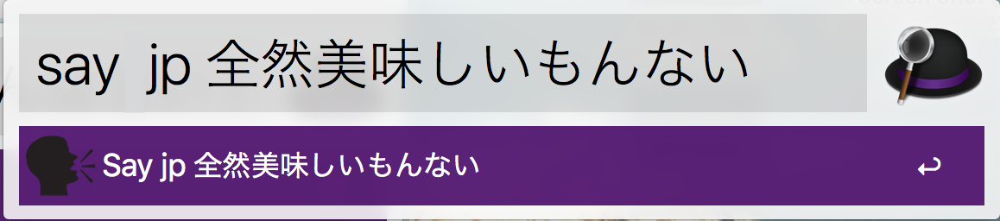

# say-workflow
---
This is the document of say-workflow.  


Does this ever happens to you?
That you just want to have a *quick check of the pronunciation* of a word/sentence without taking too much distraction.
Or you want to *suprise your classmates in a boring lecture* (and no one would realise that's you)?

Now with say-workflow, you can do all of those just with simple clicks on your keyboard.

This workflow is design for [*Alfred*](http://alfredapp.com), although it might have limited compatibility on Spotlight as well.

## Install
Double-click on say_command.alfredworkflow or info.plist in the folder, then Alfred will start loading it.  
Further configuration is done within Alfred.

## Usage
It can allows you to read some text easily without open terminal or a text file. 
1. Call Alfred on your Mac
  
1. Type in the keyword  
    
  ```say: xxx``` 
  
1. Type in either **Language code** or the text directly
  by default, it will speak in the language of your system preference:  
    
  this is the same from saying  
  `say 'Can't understand at all!'` in the Terminal.  
  or you could indicate what language do you want it to speak in:  
    
  with or without blank space after it:  
    
  and return, bob's your uncle!

Since ver. 0.4, say-workflow is able to recognise anagrams of the language codes. E.g. `Pj` and `Jp` are valid synonyms for `jp`. 

## Problem shooting
- If you would like to change the speech or add more language, just add them in the dictionary called langs in the source code.  
```langs = {'jp':'Kyoko','en':'Daniel'}```  
add it like this:  
```langs = {'jp':'Kyoko','en':'Daniel','ch':'Sinji'}```  
for voices names and their corresponding abbreviations, check [“say” in different language?](https://apple.stackexchange.com/questions/3454/say-in-different-language).
- If you type in a word but nothing has happened.
check if the text you've typed in is valid under the language you chose.
