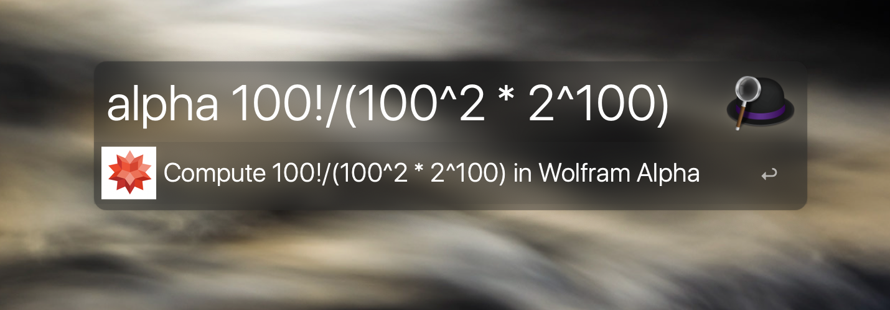
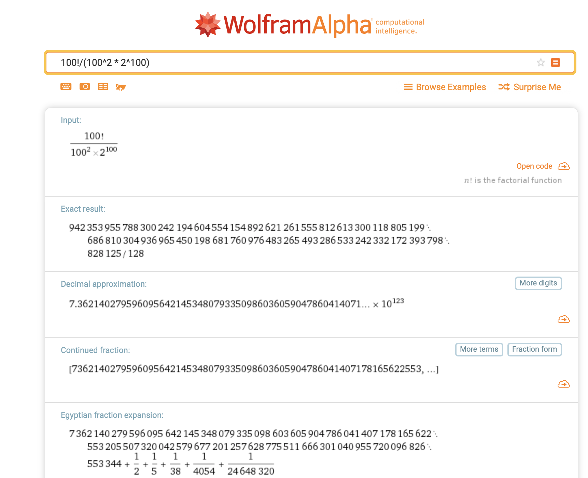

AlfredWorkflows
---
[](https://opensource.org/licenses/MIT)

[](https://github.com/BaksiLi/AlfredWorkflows/blob/master/CONTRIBUTE.md)

This is a growing repository which curates my workflow creations for [Alfred](https://www.alfredapp.com). Some of them are Terminal friendly.  

[Powerpack](https://www.alfredapp.com/powerpack/) is required to enable certain functions.

<sub>For Chinese version of this page, see [漢語版](https://github.com/BaksiLi/AlfredWorkflows/blob/master/README_CN.md).</sub>

# Catalogue
- [Should-I-do-it](https://github.com/BaksiLi/AlfredWorkflows/tree/master/Index/should_i_do_it): Aims to solve probably the biggest philosophical question in daily life:- *should I do it?*   
    Download: [here](https://github.com/BaksiLi/AlfredWorkflows/blob/master/workflows/Should.alfredworkflow?raw=true)
    
- [Say-command](https://github.com/BaksiLi/AlfredWorkflows/tree/master/Index/say-workflow): Read out something swiftly, a good reference for pronunciation.   
    Download: [here](https://github.com/BaksiLi/AlfredWorkflows/tree/master/workflows/say_command.alfredworkflow?raw=true)
    
 - [DarkOrLight](https://github.com/BaksiLi/AlfredWorkflows/tree/master/Index/DarkOrLight): Change macOS theme to Dark/Light with one click.   
 	Download: [here](https://github.com/BaksiLi/AlfredWorkflows/tree/master/workflows/DarkOrLight.alfredworkflow?raw=true)   
 
- [Fast-ascii](https://github.com/BaksiLi/AlfredWorkflows/tree/master/Index/fast-ascii): Fast convert and paste ascii.   
    Download: [here](https://github.com/BaksiLi/AlfredWorkflows/tree/master/workflows/Fast_ascii.alfredworkflow?raw=true)

# Other features
## Snippets
Please refer to the list [AlfredSnippets](https://github.com/BaksiLi/AlfredSnippets).

## Web Search
**Web Search** (in *Alfred Preferences* -> *Web Search*) enables fast queries from a website by its URL. It is simple but powerful (sorry for the cliché).   
Given its [simplicity](https://www.alfredapp.com/help/features/web-search/custom-searches/), why do I still bother to introduce it here? Because **knowing what it can do is far from know how to do it**. Here I will propose a few suggestions that could boost your efficiency. If you find the one that fancy you, just copy & paste the link to your browser to load it.

<table>
<tr>
  <th></th>
  <th></th>
  <th></th>
</tr>
<tr>
  <td>Wolfram&#124;Alpha</td>
  <td>Wolfram MathWorld</td>
  <td>Standford Encyclopaedia of Philosophy</td>
</tr>
</table>

<details>
<summary>Wolfram|Alpha</summary>

Suppose you are solving a question:
> How many times faster it is to solve TSP (Travelling Salesperson Problem), by using dynamic-programming-based algorithm () than using brute force search algorithm (), given that n=100?

The solution is obtained by computing .
It could be done in just one line:
```
alpha 100!/(100^2 * 2^100)
```

and you will see the following result in Wolfram|Alpha:

Powerful, innit?

> alfred://customsearch/Compute%20%7Bquery%7D%20in%20Wolfram%20Alpha/alpha/utf8/%2B/https%3A%2F%2Fwww.wolframalpha.com%2Finput%2F%3Fi%3D%7Bquery%7D

</details>

<details>
<summary>Wolfram MathWorld</summary>

For checking definitions in maths, stats and computer science.
> alfred://customsearch/Search%20%7Bquery%7D%20in%20Wolfram%20MathWorld/math/utf8/%2B/http%3A%2F%2Fmathworld.wolfram.com%2Fsearch%2F%3Fquery%3D%7Bquery%7D</details>

<details>
<summary>Standford Encyclopaedia of Philosophy</summary>

A good (actually the best) reference for philosophy. The official dashboard widget is so dumb that cannot be easily used nowadays. Alfred provides a perfect way to access it.
> alfred://customsearch/Search%20%7Bquery%7D%20in%20Standford%20Encyclopedia%20of%20Philosophy/sep/utf8/nospace/https%3A%2F%2Fplato.stanford.edu%2Fsearch%2Fsearcher.py%3Fquery%3D%7Bquery%7D

</details>

# Acknowledgement
This project collection is licenced under the MIT License.  
It is also published on [Packal](http://www.packal.org/users/lisongcheng), please check it if you want to have find out more Alfred widgets written by the author.

Copyright (c) 2018 BaksiLi

