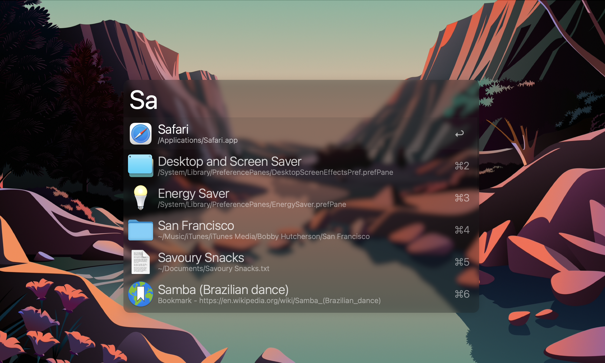
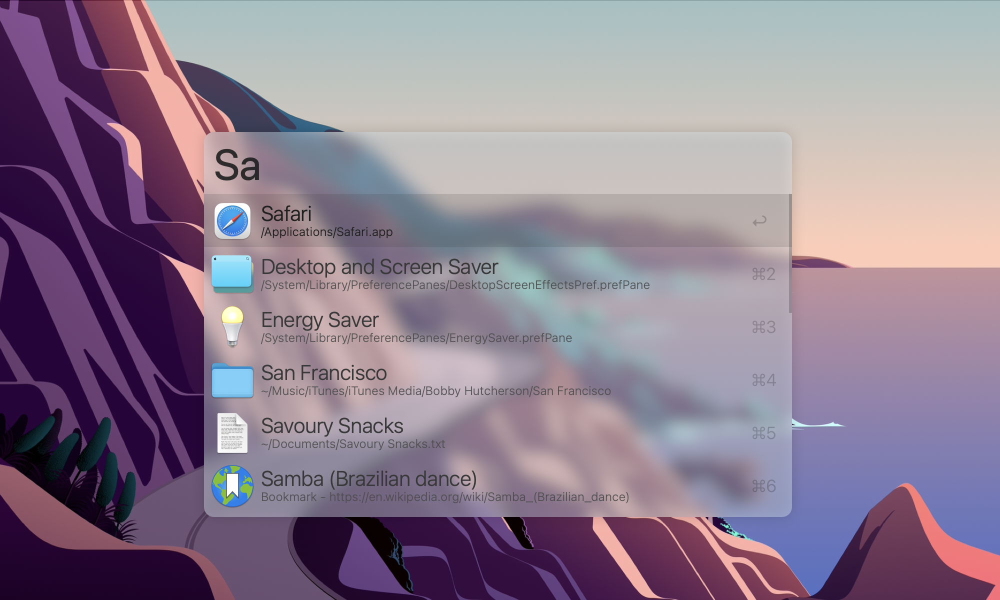
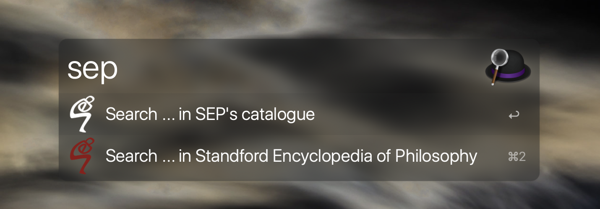

# AlfredWorkflows
[](https://opensource.org/licenses/MIT)

[](https://github.com/BaksiLi/AlfredWorkflows/blob/master/CONTRIBUTE.md)

This is a growing collection which curates my workflow creations<sup>&dagger;</sup> for [Alfred](https://www.alfredapp.com). Some of them are Terminal friendly.  

<sup>&dagger;: [Powerpack](https://www.alfredapp.com/powerpack/) is required to enable certain functions.</sup><br>

<sup>This page is also available in Chinese, see [漢語版](https://github.com/BaksiLi/AlfredWorkflows/blob/master/README_CN.md).</sup>

## Catalogue
- [Should-I-do-it](https://github.com/BaksiLi/AlfredWorkflows/tree/master/Index/should_i_do_it): Aims to solve probably the biggest philosophical question in daily life:- *should I do it?*   
    Download: [here](https://github.com/BaksiLi/AlfredWorkflows/blob/master/workflows/Should.alfredworkflow?raw=true)
    
- [Say-command](https://github.com/BaksiLi/AlfredWorkflows/tree/master/Index/say-workflow): Read out something swiftly, a good reference for pronunciation.   
    Download: [here](https://github.com/BaksiLi/AlfredWorkflows/tree/master/workflows/say_command.alfredworkflow?raw=true) or [old version (without OED pronounce feature)](https://github.com/BaksiLi/AlfredWorkflows/tree/master/workflows/say_command_0.5.alfredworkflow?raw=true)
    
 - [DarkOrLight](https://github.com/BaksiLi/AlfredWorkflows/tree/master/Index/DarkOrLight): Change macOS theme to Dark/Light with one click.   
 	Download: [here](https://github.com/BaksiLi/AlfredWorkflows/tree/master/workflows/DarkOrLight.alfredworkflow?raw=true)   
 
- [Fast-ascii](https://github.com/BaksiLi/AlfredWorkflows/tree/master/Index/fast-ascii): Fast convert and paste ascii.   
    Download: [here](https://github.com/BaksiLi/AlfredWorkflows/tree/master/workflows/Fast_ascii.alfredworkflow?raw=true)

- [Volume](https://github.com/BaksiLi/AlfredWorkflows/tree/master/Index/Volume): Adjust macOS system volume with precision.  
	Download: [here](https://github.com/BaksiLi/AlfredWorkflows/tree/master/workflows/Volume.alfredworkflow?raw=true)
	

## Other features

### Themes

|  |  |
|:-:|:-:|
| Dark | Light |
| [Install](https://www.alfredapp.com/extras/theme/uFYxkqAZGb/) or [Download](./themes/Frosty_Dark.alfredappearance) | [Install](https://www.alfredapp.com/extras/theme/BteX83Wj4G/) or [Download](./themes/Frosty_Light.alfredappearance) |

I use the **Frosty** theme family created by myself. They are *Frosty Light* and *Frosty Dark*, originally created to fit into macOS Mojave when Dark Mode was firstly introduced. Now they are updated for macOS Big Sur!

### Snippets
Please refer to the list [AlfredSnippets](https://github.com/BaksiLi/AlfredSnippets).

### Web Searches
**Web Search** (in *Alfred Preferences* -> *Web Search*) enables fast queries from a website by its URL.
Given its [simplicity](https://www.alfredapp.com/help/features/web-search/custom-searches/), why do I still bother to introduce it here? Because **knowing what it can do is far from know how to do it**. Here I will propose a few suggestions that could boost your efficiency. 

If you find the one that fancy you, just copy & paste the link to your browser to load it. The icon has to be loaded manually.

<table>
<tr>
  <th></th>
  <th></th>
  <th>//</th>
</tr>
<tr>
  <td>Wolfram&#124;Alpha</td>
  <td>Wolfram MathWorld</td>
  <td>Standford Encyclopedia of Philosophy*</td>
</tr>
</table>

<details>
<summary>Wolfram|Alpha</summary>

Suppose you are solving a question:
> How many times faster it is to solve TSP (Travelling Salesperson Problem), by using dynamic-programming-based algorithm () than using brute force search algorithm (), given that n=100?

The solution is obtained by computing .
It could be done in just one line:
```
alpha 100!/(100^2 * 2^100)
```

and you will see the following result in Wolfram|Alpha:

Powerful, innit?

> alfred://customsearch/Compute%20%7Bquery%7D%20in%20Wolfram%20Alpha/alpha/utf8/%2B/https%3A%2F%2Fwww.wolframalpha.com%2Finput%2F%3Fi%3D%7Bquery%7D

The default keyword is `alpha`.

</details>

<details>
<summary>Wolfram MathWorld</summary>

For checking definitions in maths, stats and computer science.
> alfred://customsearch/Search%20%7Bquery%7D%20in%20Wolfram%20MathWorld/math/utf8/%2B/http%3A%2F%2Fmathworld.wolfram.com%2Fsearch%2F%3Fquery%3D%7Bquery%7D

The default keyword is `math`.

</details>

<details>
<summary>Standford Encyclopaedia of Philosophy</summary>

A good (actually the best) reference for philosophy. The official dashboard widget is so dumb that cannot be easily used nowadays. Alfred provides a perfect way to access it.



> alfred://customsearch/Search%20%7Bquery%7D%20in%20Standford%20Encyclopedia%20of%20Philosophy/sep/utf8/nospace/https%3A%2F%2Fplato.stanford.edu%2Fsearch%2Fsearcher.py%3Fquery%3D%7Bquery%7D

The default keyword is `sep`.

\* Another option is to search directly in the SEP catalogue, which requires [*Friend of SEP* membership](https://plato.stanford.edu/support/friends.html). 
> alfred://customsearch/Search%20%7Bquery%7D%20in%20SEP%27s%20catalogue/sepf/utf8/%2B/https%3A%2F%2Fleibniz.stanford.edu%2Ffriends%2Fsearch_title%2F%3Fquery%3D%7Bquery%7D

The default keyword is `sepf`.

</details>

## Acknowledgement
This project collection is licensed under the MIT License.  
I use to published them on [Packal](http://www.packal.org/users/lisongcheng), you can still find the legacy versions there.

Copyright (c) 2020 BaksiLi

